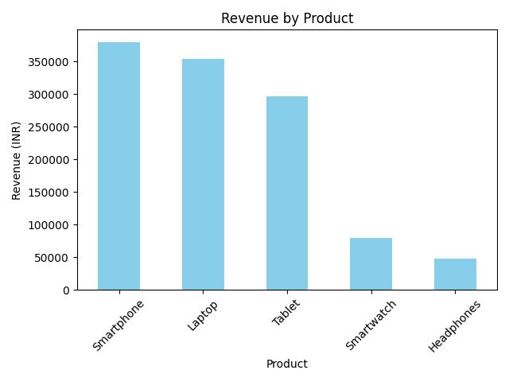
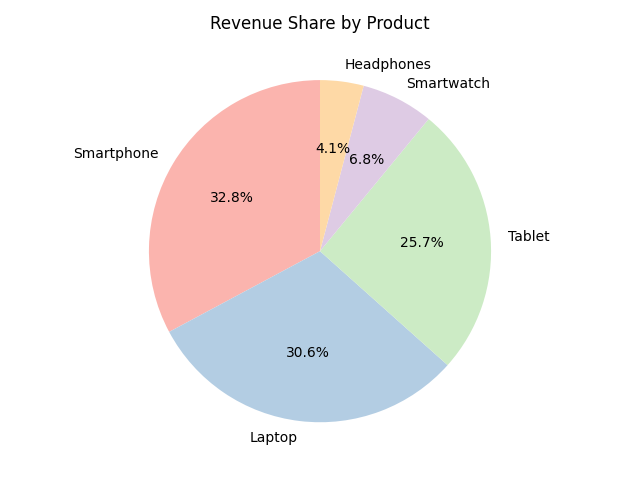
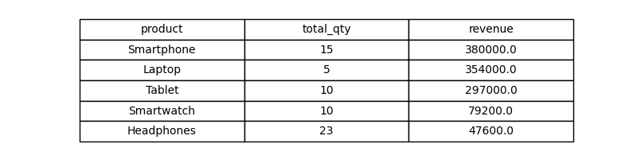

# 🧾 Task 7 – Sales Summary from SQLite using Python

## 📌 Objective

Build a basic sales summary using an SQLite database and analyze it using SQL within Python. The result is displayed with both textual and graphical summaries.

---

## 🛠️ Tools Used
- Python 3
- SQLite (via `sqlite3`)
- pandas
- matplotlib

---

## 🧱 Features Implemented

✅ Created a SQLite database `sales_data.db` and a `sales` table  
✅ Inserted realistic multi-product sales data  
✅ Executed SQL query to summarize total quantity and revenue per product  
✅ Printed summary using pandas DataFrame  
✅ Plotted a bar chart of revenue by product  
✅ Plotted a pie chart of revenue share by product  
✅ Highlighted the top-selling product  
✅ Displayed a clean tabular summary as a graphical image

---

## 📊 Sample Outputs

### 1. 📈 Revenue by Product – Bar Chart  

### 2. 🥧 Revenue Share by Product – Pie Chart  

### 3. 📋 Sales Summary – Table  

---
